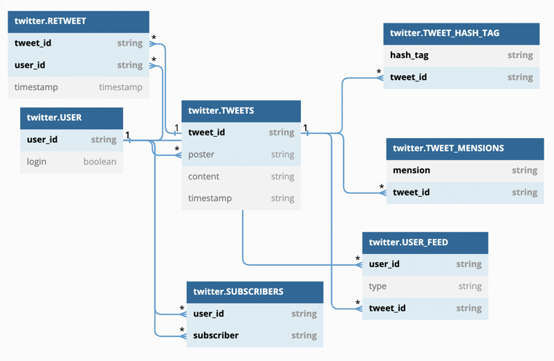
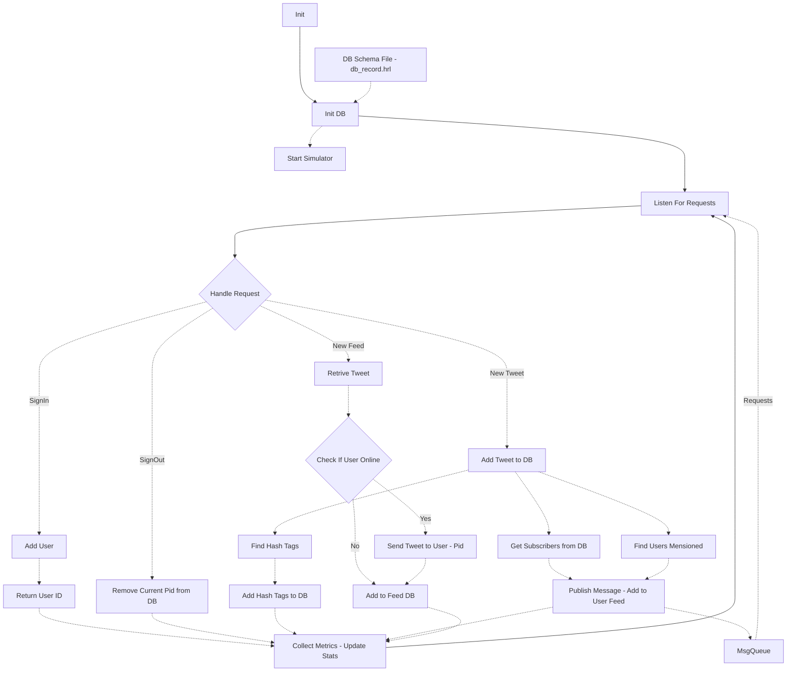
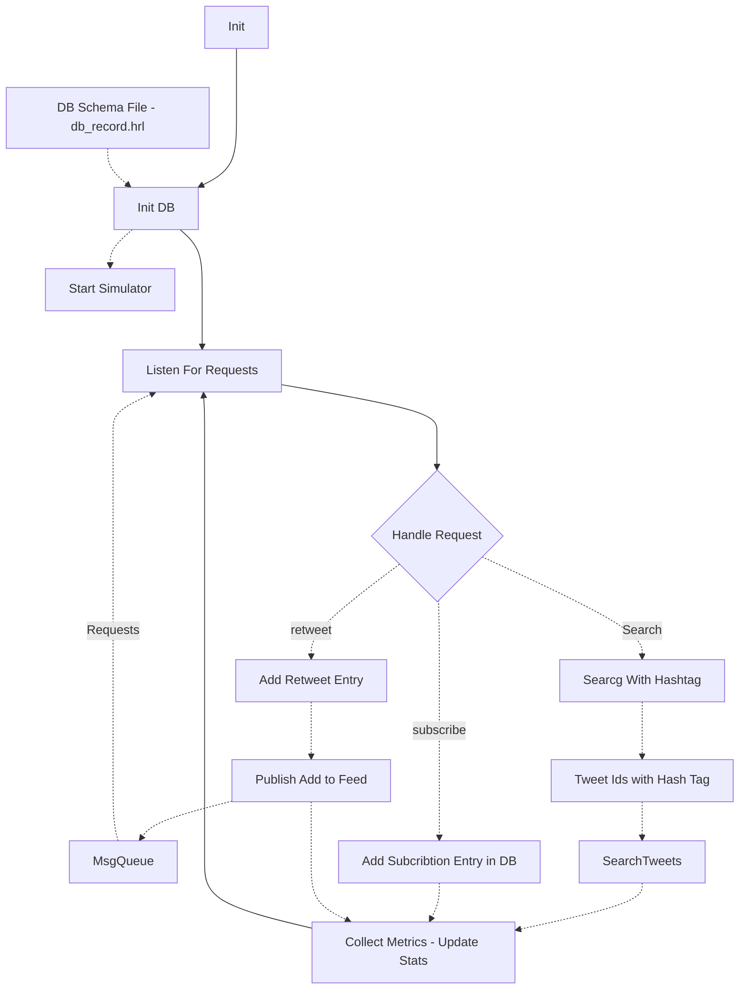
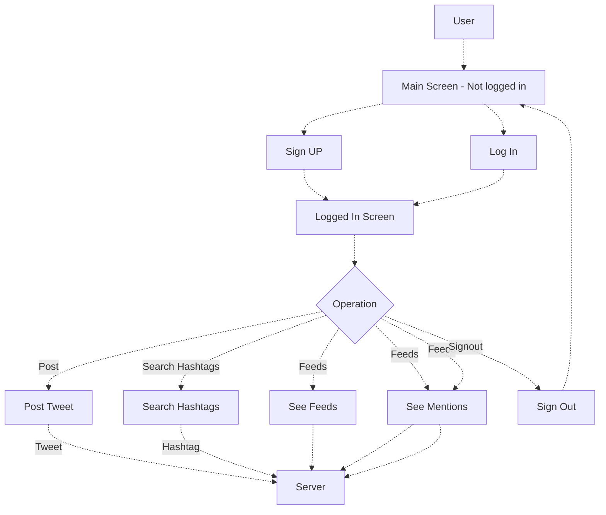
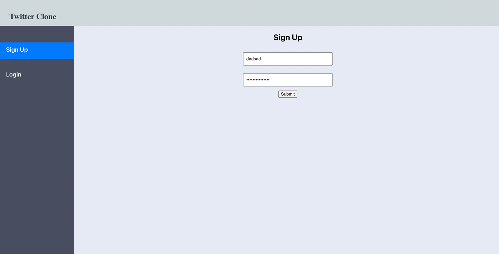
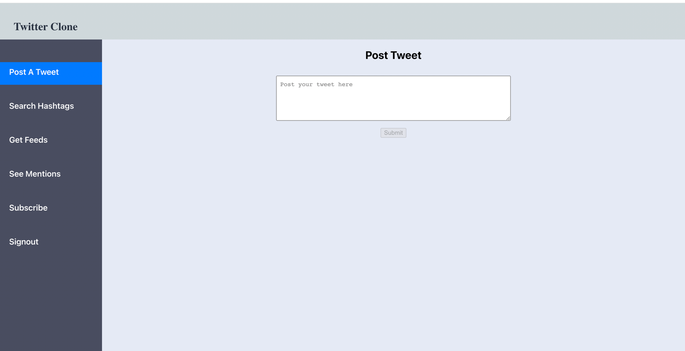

## Erlang Event Driven Twitter Engine Simulation

This is the actor model based implementation of features of erlang submitted as response
to [project 5](https://ufl.instructure.com/courses/467300/assignments/5383671)
of [COP5615](https://ufl.instructure.com/courses/467300).

### Team

| Name                     | Gator Email             | UF Id     | Github username |
|--------------------------|-------------------------|-----------|-----------------|
| Ravichandran, Ganeson    | g.ravichandran@ufl.edu  | 10798982 | GANES1998       |
| Munaga, Sai Pavan Kalyan | saipavank.munaga@ufl.edu | 88769245 | saipavankalyan  |

### DB Schema

[Db design file](db/schema/twitter.schema.dbml) is used in collaboration with the tool [dbdiagram.io](https://www.dbdiagrams.io).
The DB schema is shown here. The Db is mimiced using in memory  distributed DB framework mnesia. The mnesia configurations of various tables used are available in [db_record.hrl](src/db_record.hrl).

`

### Architecture.

#### Server Architecture.

Since the above space is suffucient to detail just 4 out of 7 operations supported by the server, the rest 3 operations
are represented in the below chart as a separate chart. The separate chart just implies same server operation and not a
separate server. The need for the below separate chart is to better distribute visual space for representing each operation
and has no significance in operation of the server.

#### JS Twitter Client (React)

The client is written using React framework in the javascript. The front end displays pages with
option for signup/login. Once the user logs in or signs up, he will see the panel with options for posting a tweet, Search 
Hashtags, See the feeds for him, View all tweets that mentioned him and Subscribe to other user, Signout after his 
interactions.

| Pages           | Function                                           | Login Required | Input Parameters                     | Output                                                           |
|-----------------|----------------------------------------------------|----------------|--------------------------------------|------------------------------------------------------------------|
| Post a Tweet    | Post a new tweet                                   | Yes            | UserId, Tweet                        | Result if the tweet is successfully posted   A Toast Message |
| Search Hashtags | Search tweets using a particular hashtag           | Yes            | Hashtag                              | List of Tweets with that hashtag                                 |
| Get Feeds       | Get List of Feeds for current usr                  | Yes            | UserId                               | List of Tweets as Feed to the user.                              |
| See Mentions    | Get List of Tweets mentioning you (logged in user) | Yes            | UserId                               | List of Tweets where the user is mentioned                       |
| Subscribe       | Subscribe to another User                          | Yes            | UserId, Subscription (other user id) | Subscription success toast message                               |
| Signout         | Logout                                             | Yes            | UserId                               | Redirects to Sign Up page                                        |
| Sign Up         | Create a new User                                  | Yes            | Username, Password                   | UserId shown in the navbar welcome text                          |

 Note, that for any logged in screen, the user Id is provided from the logged in session context, and is not explicitly provided 
 as part of the user input form.

**Architecture**

**Screenshots**

Main Landing Page (Non-Signed In)

Logged In Page

### Steps to Run

**Server**
1. Make sure, Make is available, Apple comes with default apple make and rebind the make to GUN GMake.
2. Make sure to install erlang 22. This server compiles and runs on erlang 22.
3. This project uses certain files of the first version of the project.
   1. So, copy the compiled version of the following files (beam files) and place it in the ebin directory.
     * db_connection.erl
     * db_record.hrl
     * db_util.erl
     * generate_util.erl
     * server_utils.erl
     * tweet_server.erl
   2. The part 1 of the project 4 was compiled and executed using erlang 25.1. So, please try to compile the project 4 part 1 using erlang 25.1
4. This project Uses jsone library for encoding json. So, please clone the jsone library from [github](https://github.com/sile/jsone) and then put the binaries (beam files) into the ebin directory of server
5. Execute Make run

**Client**

1. Ensure npm version 6.14.15 is available and node version is 14.18.2.
2. Move to the client directory and execute npm install to install all the libraries
3. Execute npm start to the start the client.

